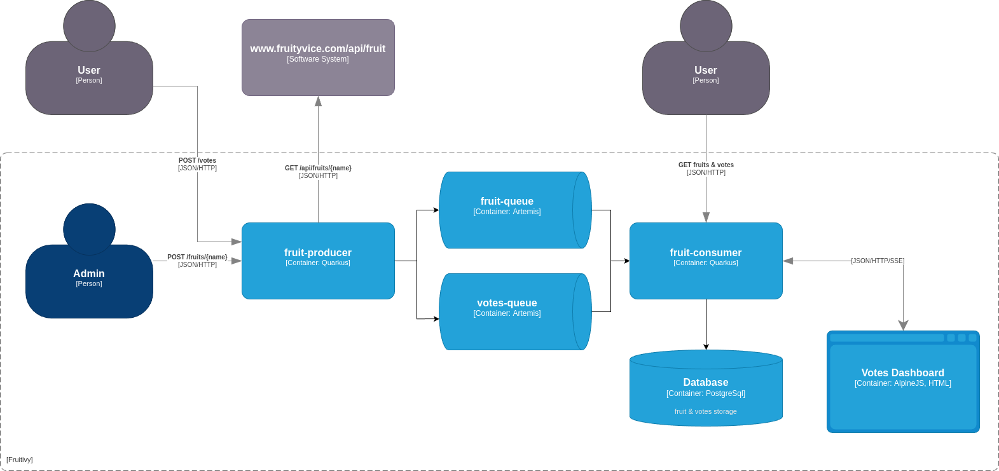

# fruit-messaging-service

This demo application shows the following features of Quarkus:

- Quarkus Panache
- Quarkus Security
- Quarkus Rest & SSE
- Microprofile Rest Client
- Microprofile Reactive Messaging

## C4 diagram 

## Prerequisites

You need the following libraries/tools to run this application:

- JDK 21
- Maven 3.x.x
- Docker/Podman
- Internet connection

## Running in dev mode

To start the application in development mode run:

> mvn quarkus:dev

in both of the projects (fruit-producer & consumer).

Then open in your browser one of the following urls:

- [Votes Dashboard](http://localhost:8081/index.html)
- [Swagger UI Producer](http://localhost:8080/q/swagger-ui)
- [Swagger UI Consumer](http://localhost:8081/q/swagger-ui)
- [Quarkus Dev-UI Producer](http://localhost:8080/q/dev)
- [Quarkus Dev-UI Consumer](http://localhost:8081/q/dev)

To use the `Votes-Dashboard`, you need to manually post some fruits first via:

> http -a bob:bob123 post :8080/fruits/{name}