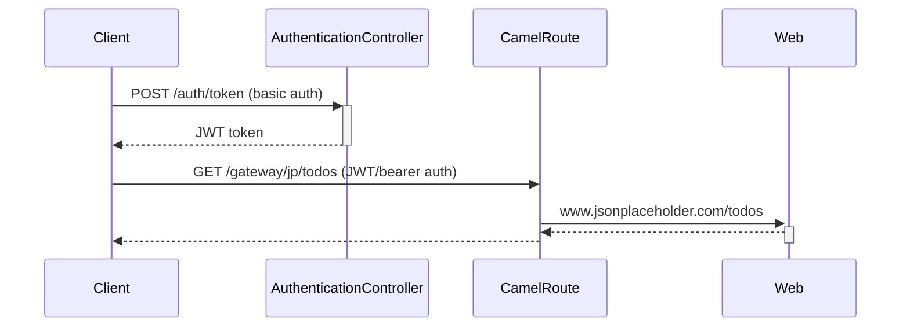

# Background

# Problem - Multipart form name not sent when uploading files

Start the app in development mode:
> mvn quarkus:dev

Then obtain a JWT token:
> JWT_TOKEN=$(http -a bob:bob post :8080/auth/token)

Then do a multipart call to Camel (e.g. upload the file `pom.xml` with form-name `file`):
> http -f -A bearer -a $JWT_TOKEN :8080/gateway/mp text='hello world' file@pom.xml

Check the logging, and you will see that `pom.xml` is out printed instead of `file` from the `AttachmentObjects`.

See also lines 88-92 in [GatewayRoute.java](src/main/java/com/acme/gateway/GatewayRoute.java)
