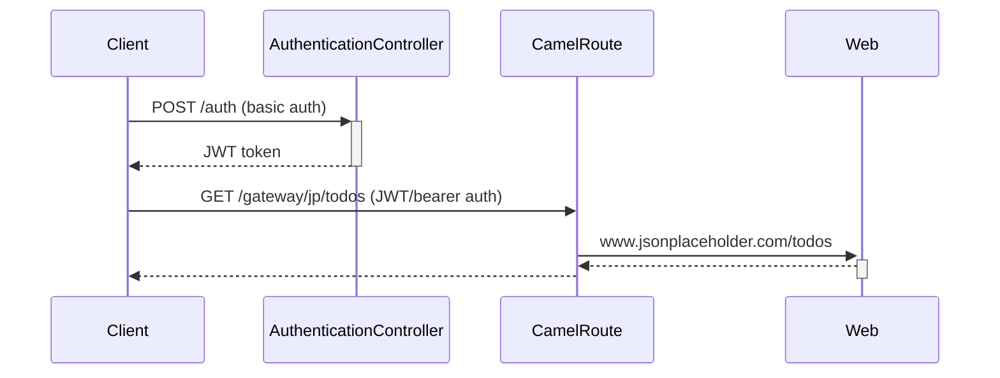

# Background



# Problem

First enable remote debugging in IntelliJ and add a breakpoint on line 20 in `AuthenticationController` then make the following call:

> http -a bob:bob post :8080/auth

Inspect the `Principal` object, and you will see that it has no username.

Or inspect the JWT token and you will see that it has an empty subject & upn.

# Cause

Comment these properties in [application.properties](./src/main/resources/application.properties):

```properties
quarkus.http.auth.permission.basic.paths=/auth/*
quarkus.http.auth.permission.basic.policy=authenticated
quarkus.http.auth.permission.basic.auth-mechanism=basic

quarkus.http.auth.permission.bearer.paths=/gateway/*
quarkus.http.auth.permission.bearer.policy=authenticated
quarkus.http.auth.permission.bearer.auth-mechanism=bearer
```

And uncomment the class `AuthenticationSelector` and make the http call again and now everything works (e.g. the JWT token should have a subject), 
because `AuthenticationSelector` kicks in and sets the authentication mechanisms correctly. 
